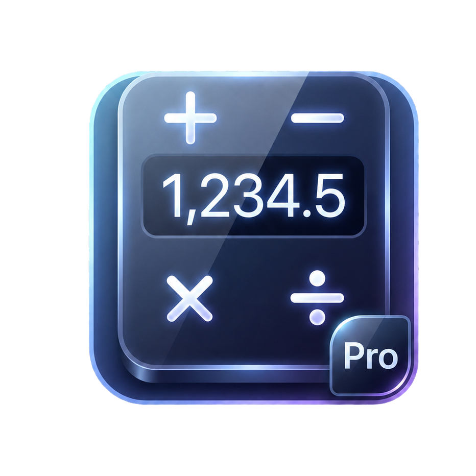

<div align="center">



# Calculator Plus

**A premium all-in-one scientific calculator with 100+ tools across physics, engineering, chemistry, mathematics, and more.**

Built — beautiful, fast, and free.

</div>

---

## ✨ Features

| | Tool | Description |
|---|---|---|
| 🧮 | **Basic Calculator** | Clean, lightning-fast everyday arithmetic |
| 🔬 | **Scientific Calculator** | Trigonometric, logarithmic, exponential & advanced functions |
| 📐 | **Algebra & Symbolic** | Equation solving, symbolic manipulation & factorization |
| 🧮 | **Linear Algebra** | Matrices, determinants, inverses & vector operations |
| 🔢 | **Number Theory** | Primes, GCD/LCM, modular arithmetic & more |
| 📊 | **Statistics** | Mean, median, mode, variance, distributions |
| 📈 | **Graphing** | Interactive 2D function plotting |
| 📏 | **Geometry** | Area, perimeter, volume & angle calculations |
| 🧊 | **3D Solids** | Surface area & volume for 3D shapes |
| ⚗️ | **Chemistry** | Molar mass, concentration, stoichiometry |
| 🔭 | **Physics & Engineering** | Kinematics, electrical, mechanical & signal tools |
| 🌍 | **Earth & Space** | Planetary & astronomical calculations |
| 💱 | **Unit Converter** | Length, mass, temperature, currency & more |
| 💻 | **Programmer Mode** | Binary / hex / octal conversions & bitwise ops |
| 💰 | **Financial** | Interest, loan, EMI & investment calculations |
| 📅 | **Date & Time** | Age, duration & calendar computations |
| 📖 | **Constants Library** | Physics & math constants at your fingertips |
| 🧠 | **Memory & History** | Store results, recall calculations, revisit history |
| 🌗 | **Themes & Haptics** | Dark/light modes, custom accents, haptic feedback |
| 🔄 | **Auto Updates** | Built-in update checker that finds new GitHub releases |

---

## 🚀 Getting Started


## 📦 Download

Pre-built signed release APKs are generated for each [GitHub release](https://github.com/proabusaleh/calculatorplus/releases).

### Latest Release — v2.0.1

| Build | Size |
|---|---|
| **Universal APK** | ~81 MB |

> **Direct download:** [CalculatorPlus-v2.0.1.apk](https://github.com/proabusaleh/calculatorplus/releases/download/v2.0.1/CalculatorPlus-v2.0.1.apk)

### Build it yourself

```bash
# Universal (all ABIs) release APK
flutter build apk --release

# Split APKs, one per ABI (smaller downloads)
flutter build apk --release --split-per-abi

# App Bundle for Play Store
flutter build appbundle --release
```

Outputs land in `build/app/outputs/flutter-apk/`.

---

## 🛠️ Tech Stack

- **Framework** — [Flutter](https://flutter.dev) 3.x with Dart 3
- **State Management** — [Provider](https://pub.dev/packages/provider)
- **Fonts** — [Google Fonts](https://pub.dev/packages/google_fonts)
- **Persistence** — [SharedPreferences](https://pub.dev/packages/shared_preferences)
- **Updates** — [http](https://pub.dev/packages/http) + [url_launcher](https://pub.dev/packages/url_launcher) via GitHub Releases
- **Icons** — [flutter_launcher_icons](https://pub.dev/packages/flutter_launcher_icons)

---

## 🗂️ Project Structure

```
lib/
├── main.dart                 # App entry point
├── models/                   # Data models (calculator, matrix, unit, ...)
├── providers/                # State management (theme, settings, memory)
├── screens/                  # 21 feature screens
├── services/                 # Domain logic & calculation engines
│   ├── update_service.dart   # GitHub release update checker
│   └── app_info.dart         # Installed app version
├── theme/                    # App theming & color system
└── widgets/                  # Reusable UI widgets
    └── update_dialog.dart    # "Update Available" prompt
```

---

## 📄 License

This project is open source and available under the [MIT License](LICENSE).

---

<div align="center">

Made By Abu Saleh
</div>
